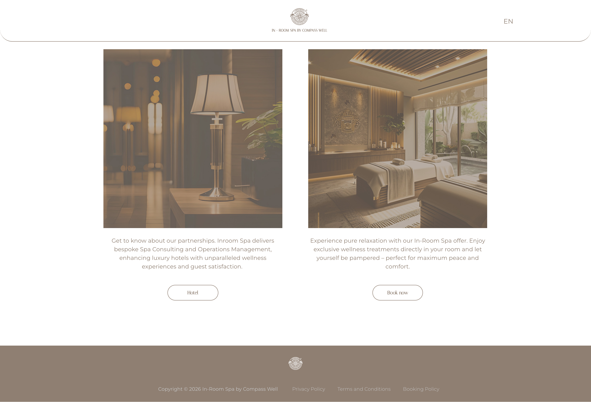

# ¡Hola! 👋

Soy Daniela.

Actualmente vivo en Valencia y estoy realizando una transición profesional desde la hostelería hacia el desarrollo web.

## 🚀 Tecnologías

* WordPress
* Elementor
* HTML
* CSS
* Git
* GitHub
* JavaScript (en aprendizaje)

## 💼 Proyectos

### Jnana Kanda Tradition

Sitio web multilingüe desarrollado con WordPress y Elementor.

**Tecnologías utilizadas:**
- WordPress
- Elementor Pro
- WooCommerce
- Amelia
- MemberPress
- CSS personalizado
- Sitio multilingüe

---

### Senses Pod

Diseño y desarrollo web utilizando WordPress y Elementor.

**Tecnologías utilizadas:**
- WordPress
- Elementor Pro
- Bookly
- HTML
- CSS

---

### In Room Spa

Sitio web para servicios de bienestar y reservas.

**Tecnologías utilizadas:**
- WordPress
- Elementor Pro
- Acuity Scheduling
- CSS personalizado

## 📚 Actualmente aprendiendo

* JavaScript
* PHP para WordPress
* Desarrollo Frontend

## 📫 Contacto

LinkedIn: https://www.linkedin.com/in/daniela-rodriguez-rieumont/

Email: danielarguez95@gmail.com
